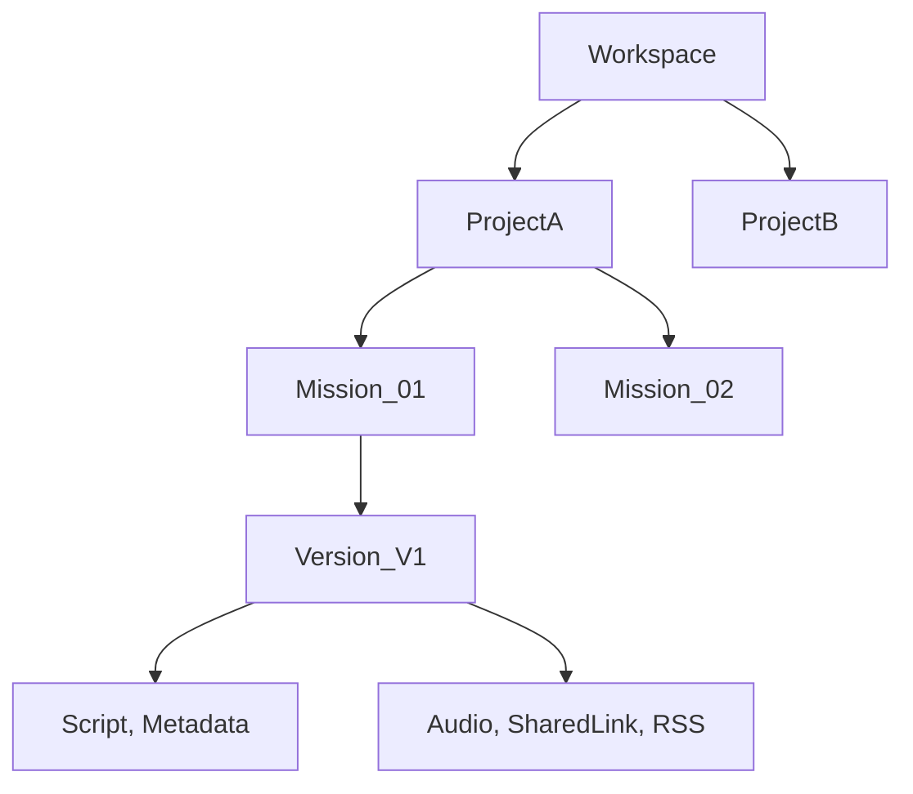

# Object Relationship Model - CommuteCast v3.2

This model standardizes the data hierarchy and relationships within the CommuteCast ecosystem.

## 1. Hierarchy Level Definitions

### **Level 1: Workspace**
- **Definition**: The entire CommuteCast instance for a specific operator.
- **Ownership**: Global.

### **Level 2: Project**
- **Definition**: A logical grouping of related missions.
- **Examples**: "Morning News", "Education Focus", "Finance Daily".
- **Attributes**: Shared Host Defaults, Shared RSS Source Groups.

### **Level 3: Mission**
- **Definition**: A single instance of a production workflow.
- **Example**: "Morning News - July 5th, 2026".
- **Attributes**: Status (Draft, Generating, Produced, Published).

### **Level 4: Version**
- **Definition**: Iterations of a specific Mission.
- **Utility**: Allows "Rollback" or comparison between different AI prompts or Host settings.

### **Level 5: Assets**
- **Definition**: The raw materials and intermediate files of a Mission.
- **Types**: `script.txt`, `thumbnail.jpg`, `metadata.json`, `subtitles.srt`.

### **Level 6: Exports**
- **Definition**: The final public-facing outputs.
- **Types**: `.mp3` (Podcast Feed), `Shared Link`, `RSS Entry`.

## 2. Visual Relationship Map

## 3. Data Governance
- Assets must never exist without a parent Mission.
- Exports are derivative of Assets and a specific Version.
- Projects act as the primary organizational unit for Search and Filtering.
